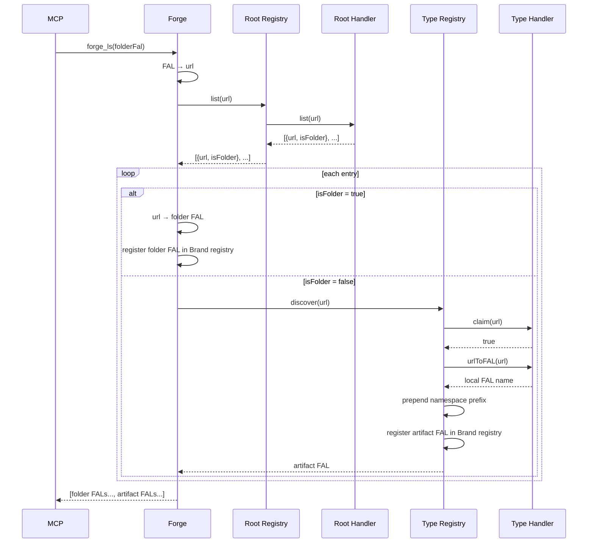
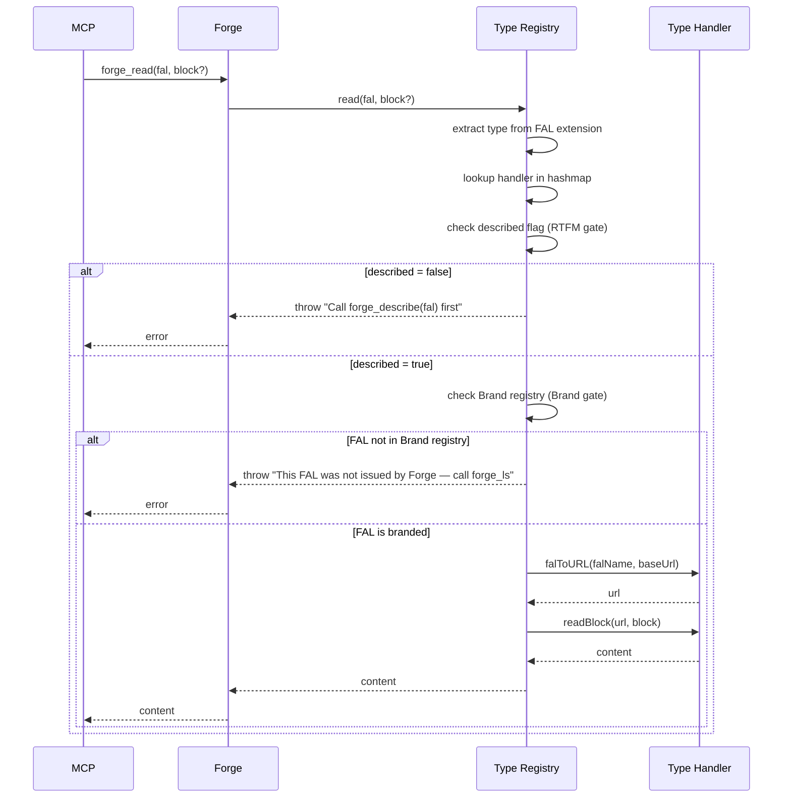
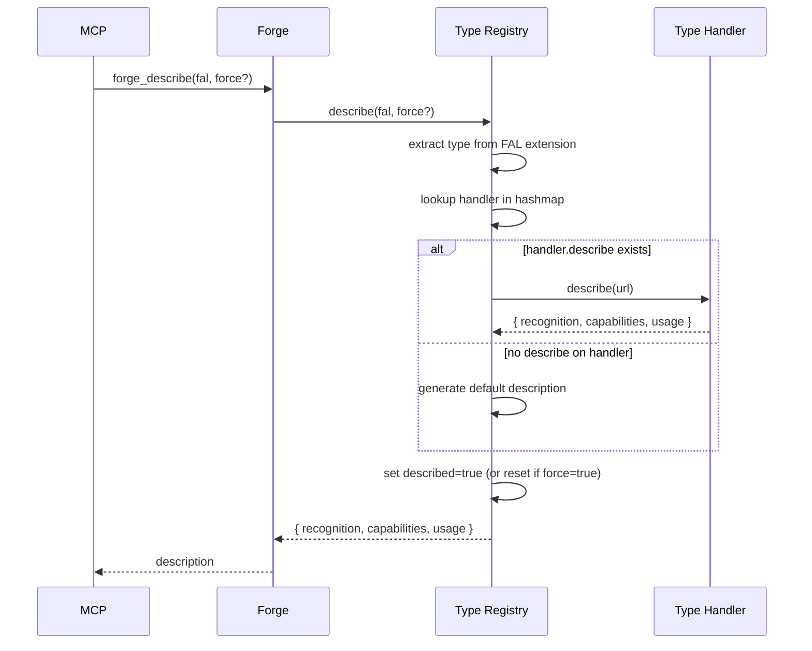

# Forge Convention

Convention for the Forge MCP server — structured, typed access layer for all projects.

*Document type: Convention*

## Quick Start

Forge is a single shared MCP server that replaces direct filesystem access with a typed, structured artifact layer.

Forge navigates a hierarchy of roots, folders, and artifacts identified by FALs (Forge Artifact Locators). A FAL is a wrapper around a URL — it adds type and block addressing on top of any underlying resource location.

Two static registries govern Forge: the root registry (folder navigation, one handler per root) and the type registry (artifact operations, one handler per type). Both are defined in the MCP configuration and cannot be changed at runtime.

Within an artifact, content is accessed via named blocks — never by line number. Block arguments are always full paths from the root block. Block content is always plain text. Order is significant — both in folder listings and in block listings.

Roots and types are organised into **namespaces**. The KB is the default namespace (no prefix). Projects and libraries declare additional namespaces, each with their own roots and types loaded recursively at startup.

## Keywords
forge, MCP, artifact, FAL, type, handler, blocks, filesystem, structured-access, URL, roots, registry, claim, type-discovery, namespace, multiproject, RTFM, describe, brand

## Table of Contents

1. [Why Forge exists](#why-forge-exists)
2. [Key concepts](#key-concepts)
3. [Forge Artifact Locator FAL](#forge-artifact-locator-fal)
4. [Blocks](#blocks)
5. [Root handler](#root-handler)
6. [Type discovery](#type-discovery)
7. [Type handlers](#type-handlers)
8. [Registry](#registry)
9. [Namespaces](#namespaces)
10. [Roots and configuration](#roots-and-configuration)
11. [MCP tools](#mcp-tools)
12. [Roadmap](#roadmap)
13. [Index](#index)

## Why Forge exists
[up](#table-of-contents)

Direct filesystem access (`filesystem` MCP) has six fundamental limitations when used by an AI Assistant:

**1. Raw access, no structure** — reads a file as a stream of lines. No understanding of sections, headings, or hierarchy. Reading one section of a large document requires loading the entire file.

**2. Tight coupling to internal structure** — any operation requires reasoning about physical layout — line numbers, delimiters, encoding. When structure changes, logic breaks. MCPs using replace or regex are brittle.

**3. No expressed intent** — `filesystem.read_file("Plan.md")` says nothing about why the file is being read. `forge_read("forge://kb/public/Plan.doc")` expresses intent — auditable, testable, reusable.

**4. No validation or constraints** — `filesystem` writes anything anywhere. A typed handler validates format and enforces structure.

**5. Token cost proportional to file size** — a 2000-line file loads 2000 lines even when one section is needed. Block access loads only what is requested and avoids boilerplate or changelogs.

**6. Conventions are advisory, not enforced** — adherence is best-effort. A Forge handler encodes the convention in its interface. Conformance becomes automatic, not hoped for.

Forge addresses all six by replacing raw file access with a structured, typed, convention-enforcing artifact layer.

**The end state:** `filesystem` and `edit-file-lines` MCP are turned off. Forge is the only artifact access path.

## Key concepts
[up](#table-of-contents)

**Root** — a named entry point in the hierarchy, defined in a roots registry with a name, a base URL, and a root handler. The name is used in absolute FALs. The base URL is the only place a physical path appears. Roots belonging to a namespace carry the namespace prefix: `commwise:production`.

**Folder** — a node in the hierarchy under a root. A folder FAL wraps a URL identified as a folder by the root handler.

**Artifact** — any non-folder resource managed by Forge. An artifact FAL wraps a URL identified as non-folder by the root handler, then typed by the type registry. An artifact may have a block structure.

**Type** — the semantic kind of an artifact. Determines which handler manages it. Types form a name hierarchy used for discovery ordering — `md-doc-convention` is more specific than `md-doc`, which is more specific than `md`. Types belonging to a namespace carry the namespace prefix: `commwise:layout`.

**Block** — a named unit of content within an artifact. Always accessed by full path from the root block, never by position or line number. Order among sibling blocks is significant. Block content is always plain text. A block may have both content of its own and child blocks — the content always precedes the children.

**Handler** — a JavaScript module. Root handlers manage folder navigation; type handlers manage artifact and block operations. Forge never calls handlers directly — all access goes through the registries.

**Namespace** — a named scope grouping roots and types belonging to a project or library. The KB is the default namespace (no prefix). All other namespaces are declared in registry files and loaded recursively at startup. A namespace is portable — its registry files can be moved to the KB or another namespace without changing their internal structure.

## Forge Artifact Locator FAL
[up](#table-of-contents)

A FAL is the unique locator of a folder, artifact, or block in Forge. It wraps a URL with type information and an optional block path. It is the primary interface between humans, AI Assistants, and Forge.

### FAL syntax

```
forge://<root-name>/[<folder>/]*[<artifact-name>.<type-name>[#<block-name>[#<block-name>]*]]
```

- `forge://<root-name>/` — mandatory, identifies the root; namespaced roots use `namespace:name`
- `[<folder>/]*` — zero or more folder names
- `<artifact-name>.<type-name>` — artifact name and its type; namespaced types use `namespace:name`
- `[#<block-name>]*` — optional block path, `#`-separated, full path from root block

A FAL ending with `/` and no artifact part is a **folder FAL**.

Names containing spaces, `/`, `#`, or other ambiguous characters must be quoted with double quotes. Literal double quotes in a name are doubled.

**Examples:**

```
forge://development/                                                          ← KB root
forge://development/big-project/                                             ← folder
forge://development/big-project/TODO.doc-todolist                            ← KB artifact
forge://development/big-project/TODO.doc-todolist#W1                         ← block
forge://kb/public/TODO.doc-todolist#section:Normale#item:W1                  ← nested block
forge://kb/public/INDEX.doc#section:Session-Bootstrap                        ← nested block
forge://commwise:production/bloc.commwise:layout                             ← namespaced root + type
forge://commwise:afr:data/rapport.commwise:afr:doc-rse                       ← chained namespace
```

### FAL as a capsule

An artifact FAL encodes two pieces of information that the type registry needs:

- **type** — extracted from the extension (after the last `.`) — used to look up the handler in the hashmap
- **URL** — reconstructed by the handler via `falToURL()` — the physical resource location

Neither piece is stored separately. The FAL is self-contained. This is why artifact FALs must carry the real type name — without it, the type registry cannot dispatch to the correct handler.

### Brand principle

A FAL is only valid if it was issued by Forge — never constructed manually. Forge maintains a Brand registry of all FALs it has emitted (via `forge_ls`, `forge_mkdir`, or any discovery operation). A FAL presented to `forge_read` or `forge_write` that is not in the Brand registry is rejected with a hint:

```
"This FAL was not issued by Forge — call forge_ls to obtain a valid FAL."
```

This is an application of **Constrain, Don't Forbid** and **Fail Fast, Fail Clear**: the constraint is mechanical (not a rule), and the error message contains its own correction. A manually constructed FAL — even syntactically correct — may carry the wrong type extension, silently routing the operation to the wrong handler and corrupting the artifact structure.

The Brand registry is session-scoped and in-memory. It is populated at startup by `forge_ls` on the root, and updated by every subsequent `forge_ls`, `forge_mkdir`, and type discovery operation.

### Root registry

Defined in registry files loaded at startup. Cannot be changed at runtime.

Each root entry:
- `name` — used in FALs (prefixed with namespace at load time)
- `url` — base URL of the root (the only place a physical path appears)
- `handler` — URL of the root handler JavaScript module

### Type registry

Defined in registry files loaded at startup. Cannot be changed at runtime.

Each type entry:
- `name` — short identifier or dash-separated hierarchy (`md`, `md-doc`, `md-doc-convention`); prefixed with namespace at load time
- `version` — handler version, used to detect staleness against the convention it implements
- `handler` — URL of the type handler JavaScript module

## Blocks
[up](#table-of-contents)

Blocks are the named units of content within an artifact. They are the only unit of access — there is no "read the whole artifact" operation outside of the anonymous root block.

**Key principles:**
- Blocks are always accessed by full path from the root block, never by position or line number.
- Order among sibling blocks is significant and preserved.
- A block may have content of its own and child blocks. The content always precedes the children.
- `readBlock` returns only the block's own content, not its children.
- Block content is always plain text.

**The anonymous block `""`** is always present at the root of the block hierarchy. It is the entry point for the full managed content of the artifact. Boilerplate managed by the handler (TOC, index, etc.) surrounds this block — invisible on read, recomputed on write.

**Block hierarchy example — `doc-todolist`:**
```
""                               (anonymous root)
  section:High-priority          (## High priority)
    item:O1                      (- [ ] [O1] ...)
    item:O2
  section:Normale
    item:W1
  changelog
    entry:"Version 2.5"
```

**Block hierarchy example — `doc`:**
```
""                               (anonymous root)
  quick-start                    (## Quick Start)
  section:Why-Forge-exists       (## Why Forge exists)
  section:Key-concepts
  changelog
    entry:"Version 4.0"
```

**Block path examples in FAL:**
```
forge://kb/public/TODO.doc-todolist#section:Normale#item:W1
forge://kb/public/INDEX.doc#section:Session-Bootstrap
forge://kb/public/CHANGELOG.doc#changelog#entry:"Version 2.0"
```

## Root handler
[up](#table-of-contents)

A root handler is a JavaScript module that manages folder navigation within a root. It operates on URLs — it receives URLs and returns URLs. It has no knowledge of Forge internals or types.

**Interface:**
```js
export async function list(url)              // list one level of folder contents
export async function mkdir(url)             // create a folder
export async function rename(url, name)      // rename a folder
export async function move(url, targetUrl)   // move a folder within the same root
export async function rmdir(url)             // delete a folder
```

**`list(url)` contract:**

Returns an ordered array of `{ url, isFolder }` entries. Order is significant and preserved.

- `isFolder: true` → Forge wraps the URL as a folder FAL.
- `isFolder: false` → Forge passes the URL to the type registry for discovery.

**Exceptions:**
- `rmdir` on a non-empty folder → error. An `undefined` artifact inside cannot be deleted, so the folder cannot be destroyed.
- Any operation on a URL outside the root → error.
- Move across roots → not supported.

## Type discovery
[up](#table-of-contents)

When the root handler returns a non-folder URL, Forge passes it to the type registry for discovery. The type registry runs discovery in two phases.

**Phase 1 — claim:**

The type registry calls `claim(url)` on all registered type handlers. Within a type hierarchy, the registry respects the order from most specific to least specific (`md-doc-convention` before `md-doc` before `md`) and **stops as soon as one handler claims the URL** — more general handlers in the same hierarchy are not called. Hierarchies that are independent of each other are all evaluated.

The hierarchy order is derived from the type names — a type name is split on `-` and longer names (more segments) are more specific. No explicit `extends` declaration is needed. The namespace prefix is stripped before computing hierarchy order — `commwise:md-doc` is treated as `md-doc` for ordering purposes within its namespace.

Claim logic is entirely the handler's responsibility. A handler may inspect the URL extension, the filename, or the file content (shebang). Examples:

- `md` — claims any `.md` file unconditionally. Called last among `md-*` types.
- `md-doc` — claims `.md` files containing a specific shebang (e.g. `*Document type:*`). Placed above `md` in the hierarchy, so it is called first and stops the chain if it claims.
- `doc-todolist` — claims files named exactly `TODO.md`. No shebang needed.

If two independent handlers could both claim the same URL (e.g. two handlers both matching `.md` with no shebang, at unrelated hierarchy positions), one solution is to introduce a shebang to distinguish them; another is to place one inside the hierarchy of the other.

**Phase 2 — outcome:**

- Exactly 1 claim → artifact typed; handler calls `urlToFAL(url)` to produce the artifact FAL.
- 0 claims → artifact assigned the built-in `undefined` type. It exists in the hierarchy (it can be listed) but no operation is possible on it. It cannot be read, written, moved, or deleted. A folder containing an `undefined` artifact cannot be deleted.
- >1 claims → error. Forge reports all claiming handlers.

## Type handlers
[up](#table-of-contents)

A type handler is a JavaScript module that manages artifacts and their block structure for a specific type. It is the executable form of a convention — conformance becomes automatic through the handler interface.

Forge never calls a type handler directly. All calls go through the type registry.

**Interface:**
```js
export const type = 'md-doc';
export const version = '1.0';

// Type discovery
export async function claim(url)                         // return true if this handler manages this URL
export async function urlToFAL(url)                      // url physique → artifact FAL name (stem.type)
export async function falToURL(falName, baseUrl)         // artifact FAL name → url physique

// Type description — RTFM principle (optional — Registry provides default if absent)
export async function describe(url)                      // return { recognition, capabilities, usage }

// Artifact CRUD
export async function createArtifact(url)                // create new artifact; error if already exists
export async function deleteArtifact(url)
export async function moveArtifact(url, targetUrl)       // within the same root only
export async function renameArtifact(url, name)

// Block operations — block arguments are always full paths from the root block ""
export async function listBlocks(url, block="")          // list one level of children under block
export async function readBlock(url, block)              // read the block's own content (not its children)
export async function writeBlock(url, block, content)    // replace the block's own content; error if artifact absent
export async function insertBlock(url, name, after, firstChild=false)
                                                         // insert a new named block
                                                         // firstChild=true: insert as first child of after
                                                         // firstChild=false: insert as sibling after after
                                                         // after="" + firstChild=false → error
export async function appendBlock(url, block, content)   // append text to a block's own content
export async function deleteBlock(url, block)            // delete a block and its children
```

**`createArtifact` / `writeBlock` contract:**

- `createArtifact(url)` — creates the artifact. Throws if it already exists. Use `forge_create` before any `forge_write`.
- `writeBlock(url, block, content)` — writes content to an existing artifact. Throws if the artifact does not exist: *"File does not exist: … — call forge_create first"*. This prevents `forge_write` from silently creating files.

**`urlToFAL(url)` and `falToURL(falName, baseUrl)`:**

These two functions are the bidirectional mapping between the physical URL and the FAL name. They are called by the type registry — never by Forge directly.

- `urlToFAL("file:///path/TODO.md")` → `"TODO.doc-todolist"`
- `falToURL("TODO.doc-todolist", "file:///path/")` → `"file:///path/TODO.md"`

The FAL name is the artifact name with its type extension — the stem may differ from the physical filename. The handler is the only place that knows this mapping. The handler uses its own local type name (without namespace prefix) — the registry applies the prefix when building the final FAL.

**`describe(url)` — Template Method pattern:**

`describe()` is optional. The type registry provides a default implementation (Template Method pattern — the registry is the abstract base, handlers are concrete subclasses). A handler overrides `describe()` only when it has richer semantics to expose than the default.

Return format:
```js
{
  recognition: "A FAL ending with .<type> is ...",  // always starts with this sentence
  capabilities: { read: true, write: true, blocks: false },
  usage: "forge_read(fal) ... forge_write(fal, content) ..."
}
```

**`recognition` rule:** the first sentence always starts with *"A FAL ending with `.<type>` …"*. This is the self-referential anchor — an AI reading this description can match it against any FAL it encounters, without any external knowledge of the type system.

**Static vs dynamic:** `describe()` may be static (plain-text — always the same regardless of the artifact) or dynamic (future md-doc — reads the artifact's actual section structure and lists real block names). Dynamic handlers receive `url` and may read the file.

**`force` flag:** `forge_describe(fal, force=true)` resets the `described` flag for the type in the current session, forcing the AI to call `forge_describe` again before the next read or write. Useful when a dynamic handler needs to re-expose the updated structure of a specific artifact.

**`listBlocks(url, block="")` contract:**

Returns an ordered list of full block paths (direct children of `block` only — one level). Paths are complete from the root block and directly reusable as arguments to any block operation. Default `block=""` lists the top-level children of the artifact.

**`insertBlock` rules:**
- `name` — full path of the new block from the root block.
- `after` — full path of an existing block.
- `firstChild=true` — inserts as the first child of `after`.
- `firstChild=false` — inserts as a sibling immediately after `after`.
- `after=""` with `firstChild=false` → error (cannot insert a sibling of the root block).

**`writeBlock` with children:** allowed. The written content becomes the block's own content, preceding its children. Children are not affected.

**Handler versioning:** each handler declares a `version`. When the convention it implements is updated, the handler becomes stale. `forge_types_check` reports stale handlers.

**Exceptions:**
- Any block operation on a non-existent block → error.
- `writeBlock` on a non-existent artifact → error (use `forge_create` first).
- `createArtifact` on an already-existing artifact → error.
- `deleteArtifact` on an `undefined` artifact → error.
- `moveArtifact` across roots → error.

## Registry
[up](#table-of-contents)

The registry layer is the only interface between Forge and the handlers. Forge never calls a handler directly — it calls a registry, which dispatches to the appropriate handler internally.

There are two registries with complementary responsibilities. Both work with URLs as their common currency.

### Type registry

The type registry manages all artifact operations. It is loaded at startup from registry files (see Namespaces). It exposes a FAL-only API to Forge — types are hidden inside the registry and encoded in the FAL.

**Internal structure:**

At startup, the type registry builds a hashmap: `typeName → { handler, described }`. Type names in the hashmap carry their full namespace prefix (`commwise:layout`). The `described` flag is `false` at startup and set to `true` by `typeRegistry.describe()` — it tracks whether the AI has called `forge_describe` for this type in the current session. The type hierarchy order (for `claim()` dispatch) is derived from the local type name (prefix stripped) — names are split on `-` and sorted by descending length (more segments = more specific). No explicit ordering configuration is needed.

**Collision check:** after all namespaces are loaded, if two entries share the same final name in the hashmap → startup error. Forge does not start. This applies to both roots and types.

**API exposed to Forge:**

```js
// Discovery — url physique → FAL (called by Forge during forge_ls)
typeRegistry.discover(url)                          → fal

// Type description — RTFM principle
typeRegistry.describe(fal, force?)                  → { recognition, capabilities, usage }
                                                    // sets described=true for the type (or resets if force=true)

// Artifact operations — all take a FAL, dispatch to handler via type extraction + falToURL()
// All throw if described=false for the type — RTFM gate
// All throw if FAL not in Brand registry — Brand gate
typeRegistry.read(fal, block?)                      → content
typeRegistry.write(fal, block, content)
typeRegistry.listBlocks(fal, block?)                → string[]
typeRegistry.createArtifact(fal)
typeRegistry.deleteArtifact(fal)
typeRegistry.moveArtifact(fal, targetFal)
typeRegistry.renameArtifact(fal, name)
typeRegistry.insertBlock(fal, name, after, firstChild?)
typeRegistry.appendBlock(fal, block, content)
typeRegistry.deleteBlock(fal, block)
```

**RTFM gate:** `read()` and `write()` (and all block operations) check `described` before dispatching. If `false`, they throw: `"Call forge_describe(fal) first — RTFM: no read or write before the type is understood."`

**Brand gate:** `read()` and `write()` (and all block operations) check the Brand registry before dispatching. If the FAL is not registered, they throw: `"This FAL was not issued by Forge — call forge_ls to obtain a valid FAL."` The Brand gate is checked after the RTFM gate.

**Default `describe()` implementation (Template Method):** if the handler does not export `describe`, the registry generates a default description from the type name:
```js
{
  recognition: `A FAL ending with .${typeName} is a plain-text file — full file access only, no named blocks.`,
  capabilities: { read: true, write: true, blocks: false },
  usage: `forge_read(fal) returns the entire file content. forge_write(fal, content) replaces the entire file.`
}
```

**Dispatch mechanism** (same for all artifact operations):
1. Extract type from FAL extension (after last `.`)
2. Look up handler in hashmap — O(1)
3. Check `described` flag — throw if `false` (RTFM gate)
4. Check Brand registry — throw if FAL not registered (Brand gate)
5. Call `handler.falToURL(falName, baseUrl)` to recover the physical URL
6. Delegate to handler

**`discover(url)` mechanism:**
1. Call `claim(url)` on handlers, most specific first (derived from local type name length)
2. Stop at first claim
3. Call `handler.urlToFAL(url)` to produce the local FAL name
4. Prepend namespace prefix to produce the final type name in the FAL
5. Register the resulting FAL in the Brand registry
6. Return the complete FAL

### Root registry

The root registry manages folder navigation. It is loaded at startup from registry files (see Namespaces). Each root has exactly one handler — no dispatch needed.

Folder FALs are derived directly from URLs by Forge (strip the base URL, prepend `forge://<root>/`) — the root registry does not manage FAL encoding.

**API exposed to Forge:**

```js
rootRegistry.list(url)                              → { folders: url[], artifacts: url[] }
rootRegistry.mkdir(url)
rootRegistry.rmdir(url)
rootRegistry.mvdir(url, targetUrl)
rootRegistry.rndir(url, name)
```

**Forge responsibilities for folders:**

Forge translates between folder FALs and URLs before calling the root registry:
- FAL → URL: strip `forge://<root>/`, prepend root base URL
- URL → FAL: strip root base URL, prepend `forge://<root>/`

Folder FALs are also registered in the Brand registry when emitted by `forge_ls` or `forge_mkdir`.

### Sequence diagrams

**`forge_ls` — folder listing:**



**`forge_read` — artifact read (with RTFM + Brand gates):**



**`forge_describe` — type description:**



## Namespaces
[up](#table-of-contents)

A namespace groups roots and types belonging to a project or library. The KB is the default namespace — its roots and types carry no prefix. All other namespaces are declared in registry files and loaded recursively at startup.

### Why namespaces

- **Isolation** — a project's types and roots cannot clash with the KB or another project, even if they share the same local names.
- **Portability** — a namespace registry file is self-contained. It can be promoted to the KB, merged into another namespace, or shared as a standalone library without changing its internal structure.
- **Composability** — a namespace can declare child namespaces, which declare their own, and so on. The loading algorithm is the same at every level — the recursion is the design.

### Namespace declaration

Namespaces are declared inside roots or types registry files using a `namespaces` array. Each entry specifies a namespace name, and optionally a roots registry file, a types registry file, or both.

**roots.json with namespaces:**
```json
{
  "roots": [
    { "name": "production", "url": "...", "handler": "..." }
  ],
  "namespaces": [
    {
      "namespace": "commwise",
      "roots": "file:///commwise/.../roots.json",
      "types": "file:///commwise/.../types.json"
    }
  ]
}
```

**types.json with namespaces:**
```json
{
  "types": [
    { "name": "layout", "version": "1.0", "handler": "..." }
  ],
  "namespaces": [
    {
      "namespace": "afr",
      "types": "file:///afr/.../types.json"
    }
  ]
}
```

A namespace entry may omit `roots` or `types` if the namespace only contributes one kind. Both fields are optional, but at least one must be present.

### Loading algorithm

Forge loads namespaces recursively at startup. The algorithm is identical at every level — there is no distinction between root-level and child-level loading.

```
function loadRegistry(file, prefixSoFar):
  data = readJSON(file)

  for each root in data.roots:
    finalName = prefixSoFar + root.name          // "" + "development" = "development"
    rootRegistry.register(finalName, root)        // collision → startup error

  for each type in data.types:
    finalName = prefixSoFar + type.name          // "commwise:" + "layout" = "commwise:layout"
    typeRegistry.register(finalName, type)        // collision → startup error

  for each namespace in data.namespaces:
    childPrefix = prefixSoFar + namespace.name + ":"
    if namespace.roots:
      loadRegistry(namespace.roots, childPrefix)
    if namespace.types:
      loadRegistry(namespace.types, childPrefix)
```

**Entry point** — Forge starts from `forge.config.json`:
```
loadRegistry(config.roots_file, "")   // KB roots, no prefix
loadRegistry(config.types_file, "")   // KB types, no prefix
```

### Prefix rules

- KB (default namespace): no prefix — `md`, `doc-todolist`, `development`
- Direct namespace: `commwise:layout`, `commwise:production`
- Chained namespace: `commwise:afr:doc-rse`, `commwise:afr:data` — parent prefix accumulates

### Collision rule

Two roots or two types with the same final name (after prefix) → **startup error**. Forge does not start. The error message identifies both conflicting entries and their source files.

This is enforced at hashmap insertion time — the check is O(1) per entry and costs nothing at runtime.

### FAL examples with namespaces

```
forge://development/kb/INDEX.md                         ← KB root, KB type (no prefix)
forge://commwise:production/bloc.commwise:layout        ← commwise root, commwise type
forge://commwise:afr:data/rapport.commwise:afr:doc-rse  ← chained namespace root and type
```

### Namespace portability

A namespace registry file has no knowledge of its position in the loading tree. It declares names relative to itself — the prefix is applied externally by the loader. This means:

- A type `layout` in `commwise/types.json` becomes `commwise:layout` when loaded under the `commwise` namespace, and `mylib:commwise:layout` if that namespace is itself nested under `mylib`.
- Moving a namespace from one parent to another only requires updating the `namespace` declaration in the parent — the child files are unchanged.
- Promoting a namespace to the KB means removing the namespace wrapper — its types and roots become unprefixed KB entries.

## Roots and configuration
[up](#table-of-contents)

Forge is a **single shared process** across all projects. There is no per-project instance. Each project lives under a named root, in its own namespace if it defines project-specific roots or types.

**Configuration file:** `public/tools/forge/forge.config.json`

```json
{
  "roots": "file:///C:/Users/RemiLequette/Development/with-claude/knowledgebase/public/tools/forge/roots.json",
  "types": "file:///C:/Users/RemiLequette/Development/with-claude/knowledgebase/public/tools/forge/types.json"
}
```

**KB roots.json** (default namespace, no prefix):
```json
{
  "roots": [
    {
      "name": "development",
      "url": "file:///C:/Users/RemiLequette/Development",
      "handler": "file:///C:/Users/RemiLequette/Development/with-claude/knowledgebase/public/tools/forge/handlers/file-root.js"
    },
    {
      "name": "dropbox",
      "url": "file:///C:/Users/RemiLequette/Dropbox",
      "handler": "file:///C:/Users/RemiLequette/Development/with-claude/knowledgebase/public/tools/forge/handlers/file-root.js"
    }
  ],
  "namespaces": [
    {
      "namespace": "commwise",
      "roots": "file:///C:/Users/RemiLequette/Development/commwise/tools/forge/roots.json",
      "types": "file:///C:/Users/RemiLequette/Development/commwise/tools/forge/types.json"
    }
  ]
}
```

**KB types.json** (default namespace, no prefix):
```json
{
  "types": [
    { "name": "md",           "version": "1.0", "handler": "file:///...handlers/md.js" },
    { "name": "md-doc",       "version": "1.0", "handler": "file:///...handlers/md-doc.js" },
    { "name": "doc-todolist", "version": "2.5", "handler": "file:///...handlers/doc-todolist.js" }
  ]
}
```

Root and type names are short, lowercase, no spaces. URLs are the only place physical paths appear.

**Claude Desktop configuration** (`claude_desktop_config.json`):
```json
{
  "mcpServers": {
    "forge": {
      "command": "node",
      "args": ["C:\\Users\\RemiLequette\\Development\\with-claude\\knowledgebase\\public\\tools\\forge\\forge.js"]
    }
  }
}
```

**Installation:**
```
cd public/tools/forge
npm install
```

`node_modules/` is gitignored — `npm install` is required after every clone or pull.

**Log file:** `forge.log` is written alongside `forge.js`. It is gitignored.

## MCP tools
[up](#table-of-contents)

All tools accept FALs. Folder FALs end with `/`. Block paths use `#`. Namespaced roots and types use `:` as separator. See the FAL section for syntax and quoting rules.

Forge implements each tool by translating the MCP call into one or two registry calls — no additional logic.

**Error handling:** Forge wraps the entire tool dispatcher in a single top-level `try/catch`. Any exception thrown by a registry or handler is caught and returned as `{ error: err.message }` with `isError: true`. Tools and handlers must always throw exceptions on error — never return error objects. A tool may add its own `try/catch` only to enrich the error message with context before re-throwing.

**RTFM principle:** `forge_read` and `forge_write` (and all block operations) require a prior `forge_describe` call for the artifact's type in the current session. Without `forge_describe`, read and write throw `"Call forge_describe(fal) first"`.

**Brand principle:** `forge_read` and `forge_write` (and all block operations) require the FAL to have been issued by Forge. A manually constructed FAL is rejected with `"This FAL was not issued by Forge — call forge_ls to obtain a valid FAL."` The Brand gate is checked after the RTFM gate. `forge_ls` is always free — it is the tool that issues branded FALs.

**Implemented:**

| Tool | Arguments | Description |
|---|---|---|
| `forge_ping` | — | Connectivity check — returns `pong` and server version |
| `forge_ls` | `fal?` | List one level. No arg: list roots. Folder FAL: list folders and artifacts with their FALs. Always free — no describe or brand required. Issues branded FALs. |
| `forge_describe` | `fal, force?` | Describe the type of an artifact — returns `{ recognition, capabilities, usage }`. Sets `described=true` for the type in the session. `force=true` resets the flag. |
| `forge_read` | `fal, block?` | Read a block's own content. Defaults to `""` — full managed content. Requires RTFM + Brand. |
| `forge_create` | `fal` | Create a new empty artifact. Error if it already exists. Required before any `forge_write` on a new file. |
| `forge_write` | `fal, block?, content` | Write content to an existing artifact. Error if the artifact does not exist — use `forge_create` first. Plain-text: full file. Structured: named block. Requires RTFM + Brand. |
| `forge_mkdir` | `fal` | Create a folder. Error if it already exists. Issues a branded folder FAL. |
| `forge_rmdir` | `fal` | Delete a folder. Error if not empty. |
| `forge_mvdir` | `fal, target` | Move a folder within the same root. Error if target exists. |
| `forge_rndir` | `fal, name` | Rename a folder in place. Error if target name exists in the same parent. |

**Planned — artifacts:**

| Tool | Arguments | Description |
|---|---|---|
| `forge_delete` | `fal` | Delete an artifact |
| `forge_move` | `fal, target` | Move an artifact within the same root |
| `forge_rename` | `fal, name` | Rename an artifact |

**Planned — blocks:**

| Tool | Arguments | Description |
|---|---|---|
| `forge_append` | `fal, block, content` | Append text to a block's own content |
| `forge_insert` | `fal, name, after, firstChild?` | Insert a new named block |
| `forge_delete_block` | `fal, block` | Delete a block and its children |

**Planned — registry:**

| Tool | Arguments | Description |
|---|---|---|
| `forge_types_list` | — | List all registered types with their namespace |
| `forge_types_get` | `type` | Get a type definition and handler version |
| `forge_types_check` | — | Report handlers whose version is behind their convention |
| `forge_roots_list` | — | List all registered roots with their namespace |

## Roadmap
[up](#table-of-contents)

**Near term:**
- Implement `forge_describe` + RTFM gate in `forge.js` — `described` flag in type registry, gate on `forge_read`/`forge_write`
- Implement Brand registry — session-scoped in-memory set of issued FALs; Brand gate on `forge_read`/`forge_write`; FALs registered by `forge_ls` and `forge_mkdir`
- Refactor `forge.js` — introduce type registry and root registry objects; Forge calls only registries
- Split `forge.config.json` into `roots.json` and `types.json`; implement recursive namespace loader
- Add `urlToFAL()` and `falToURL()` to all type handlers
- Register first real types: `md`, `md-doc`, `doc-todolist`
- Implement remaining artifact CRUD: `forge_delete`, `forge_move`, `forge_rename`
- Implement block CRUD: `forge_append`, `forge_insert`, `forge_delete_block`
- Registry viewer — HTML tool browsing roots, types, namespaces, and artifacts via Forge

**Medium term:**
- Absorb `local-server` — single process for MCP interface and static HTTP layer
- `md-doc` tool absorbed as handler logic for `md-doc` type

**Long term:**
- `type-doc` — declarative type descriptor (extension, shebang, block structure) that generates a handler automatically. Makes adding a new type a configuration task, not a coding task.
- `filesystem` MCP disabled in all project instructions

## Index

| Term | Occurrences |
|------|-------------|

## Changelog

### Version 6.5 - forge_create implemented; forge_write requires existing file
**Date:** 2026-06-07
**Reason:** Two spec violations corrected: (1) `forge_write` was silently creating files via `fs.writeFileSync` even when the artifact did not exist — now throws "File does not exist: … — call forge_create first"; (2) `forge_create` was stubbed as "not implemented" — now creates an empty file and throws if the file already exists. `forge_create` promoted from Planned to Implemented in the MCP tools table.

**Modifications:**
- Type handlers: `createArtifact` contract note added; `writeBlock` contract updated — throws if artifact absent
- Type handlers / Exceptions: `writeBlock` on non-existent artifact added; `createArtifact` on existing artifact added
- MCP tools / Implemented: `forge_create` row added; `forge_write` description updated — "Error if the artifact does not exist"
- MCP tools / Planned: `forge_create` row removed (now implemented)
- Roadmap: "Implement artifact CRUD" updated — `forge_create` done, remaining items listed
- `plain-text.js` v1.3: `writeBlock` — existsSync guard added; `createArtifact` — implemented
- `forge.js` v2.4: `forge_create` tool added (ListTools + dispatcher)

---

### Version 6.4 - Brand principle
**Date:** 2026-06-07
**Reason:** TDD session — Brand principle specced before implementation. A FAL is only
valid if issued by Forge. Prevents type errors caused by manually constructed FALs.
Application of Constrain Don't Forbid and Fail Fast Fail Clear.

**Modifications:**
- Keywords: `brand` added
- FAL section: `### Brand principle` added — Brand registry, session scope, Fail Fast Fail Clear error message
- Registry / Type registry: Brand gate added to API comment; Brand gate step added to dispatch mechanism (step 4); `discover()` step 5 added — register FAL in Brand registry
- Registry / Root registry: folder FAL Brand registration note added
- Registry / Sequence diagrams: `forge_ls` updated — Brand registry registration steps added; `forge_read` updated — Brand gate added after RTFM gate
- MCP tools: Brand principle paragraph added; `forge_ls` description updated — "Issues branded FALs"; `forge_read`/`forge_write` descriptions updated — "Requires RTFM + Brand"
- Roadmap: Brand registry implementation added as second near-term item

---

### Version 6.3 - RTFM principle + forge_describe
**Date:** 2026-06-07

---

### Version 6.2 - Folder CRUD implemented
**Date:** 2026-06-07

---

### Version 6.1 - Top-level error handler
**Date:** 2026-06-07

---

### Version 6.0 - Namespace model
**Date:** 2026-06-07

---

### Version 5.0 - Registry API and sequence diagrams
**Date:** 2026-06-06

---

### Version 4.0 - Handler interfaces, block model, config fully specified
**Date:** 2026-06-06

---

### Version 3.0 - Root handler, type handlers, type discovery rewritten
**Date:** 2026-06-06

---

### Version 2.0 - FAL, key concepts, type model, support model
**Date:** 2026-06-06

---

### Version 1.0 - Creation
**Date:** 2026-06-06
**Reason:** Forge designed and proto implemented in session "death to filesystem".
