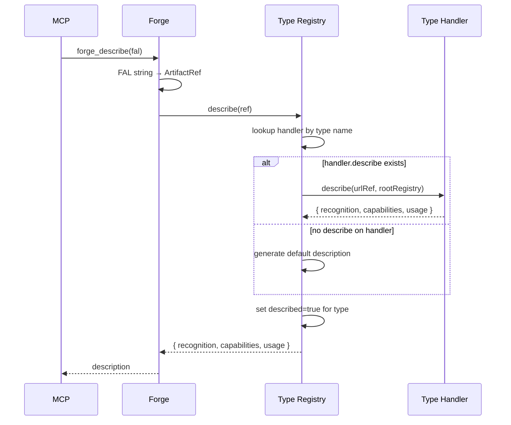

# Forge Convention

Convention for the Forge MCP server — structured, typed access layer for all projects.

*Document type: Convention*

## Quick Start

Forge is a single shared MCP server that replaces direct filesystem access with a typed, structured artifact layer.

Forge navigates a hierarchy of roots, folders, and artifacts identified by FALs (Forge Artifact Locators). A FAL is the external string representation of an artifact address — parsed by Forge into an `ArtifactRef` at the MCP boundary, never passed as a string to internal components.

Two registries govern Forge: the root registry (folder navigation and storage access) and the type registry (artifact typing and block operations). Both are defined in the MCP configuration and cannot be changed at runtime.

Within an artifact, content is accessed via named blocks — never by line number. Block arguments are always full paths from the root block. Block content is always plain text. Order is significant — both in folder listings and in block listings.

Roots and types are organised into **namespaces**. The KB is the default namespace (no prefix). Projects and libraries declare additional namespaces, each with their own roots and types loaded recursively at startup.

## Keywords
forge, MCP, artifact, FAL, ArtifactRef, UrlRef, IRootRegistry, type, handler, blocks, filesystem, structured-access, roots, registry, claim, type-discovery, namespace, multiproject, RTFM, describe, brand, init, descriptor, factory

## Table of Contents

1. [Why Forge exists](#why-forge-exists)
2. [Key concepts](#key-concepts)
3. [Forge Artifact Locator FAL](#forge-artifact-locator-fal)
4. [Blocks](#blocks)
5. [Root registry](#root-registry)
6. [Type discovery](#type-discovery)
7. [Type handlers](#type-handlers)
8. [Registry](#registry)
9. [Namespaces](#namespaces)
10. [Roots and configuration](#roots-and-configuration)
11. [MCP tools](#mcp-tools)
12. [Roadmap](#roadmap)
13. [Index](#index)

## Why Forge exists
[up](#table-of-contents)

Direct filesystem access (`filesystem` MCP) has six fundamental limitations when used by an AI Assistant:

**1. Raw access, no structure** — reads a file as a stream of lines. No understanding of sections, headings, or hierarchy. Reading one section of a large document requires loading the entire file.

**2. Tight coupling to internal structure** — any operation requires reasoning about physical layout — line numbers, delimiters, encoding. When structure changes, logic breaks. MCPs using replace or regex are brittle.

**3. No expressed intent** — `filesystem.read_file("Plan.md")` says nothing about why the file is being read. `forge_read("forge://kb/public/Plan.doc")` expresses intent — auditable, testable, reusable.

**4. No validation or constraints** — `filesystem` writes anything anywhere. A typed handler validates format and enforces structure.

**5. Token cost proportional to file size** — a 2000-line file loads 2000 lines even when one section is needed. Block access loads only what is requested and avoids boilerplate or changelogs.

**6. Conventions are advisory, not enforced** — adherence is best-effort. A Forge handler encodes the convention in its interface. Conformance becomes automatic, not hoped for.

Forge addresses all six by replacing raw file access with a structured, typed, convention-enforcing artifact layer.

**The end state:** `filesystem` and `edit-file-lines` MCP are turned off. Forge is the only artifact access path.

## Key concepts
[up](#table-of-contents)

**Root** — a named entry point in the hierarchy, defined in a roots registry with a name, a base URL, and a root handler. The name is used in absolute FALs. The base URL is the only place a physical path appears. Roots belonging to a namespace carry the namespace prefix: `commwise:production`.

**Folder** — a node in the hierarchy under a root. A folder FAL wraps a URL identified as a folder by the root handler.

**Artifact** — any non-folder resource managed by Forge. An artifact FAL wraps a URL identified as non-folder by the root handler, then typed by the type registry. An artifact may have a block structure.

**Type** — the semantic kind of an artifact. Determined by the type handler that claims it during discovery. The root registry labels resources with an extension (storage metadata); the type registry interprets that label and the content to assign a type (semantics). Types form a name hierarchy used for discovery ordering — `md-doc-convention` is more specific than `md-doc`, which is more specific than `md`. Types belonging to a namespace carry the namespace prefix: `commwise:layout`.

**Block** — a named unit of content within an artifact. Always accessed by full path from the root block, never by position or line number. Order among sibling blocks is significant. Block content is always plain text. A block may have both content of its own and child blocks — the content always precedes the children.

**ArtifactRef** — the internal decomposed form of an artifact FAL. Forge parses FAL strings into `ArtifactRef` at the MCP boundary and rebuilds FAL strings from `ArtifactRef` on output. Internal components never work with FAL strings directly.

```js
{ root, path, name, type }
// e.g. { root: "development", path: "kb/public/", name: "INDEX", type: "md" }
```

**UrlRef** — the internal decomposed form of a resource URL, managed exclusively by the root registry. URLs never leave the root registry — only `UrlRef` objects circulate between the root registry and other components. The root registry is the sole authority on URL syntax.

```js
{ root, path, name, extension }
// e.g. { root: "development", path: "kb/public/", name: "INDEX", extension: ".md" }
```

**IRootRegistry** — the interface the type registry and type handlers use to access storage. Implemented by the root registry. Exposes artifact CRUD operations on `UrlRef` objects. Storage details (filesystem, database, archive, binary addressing) are entirely hidden behind this interface — type handlers are storage-agnostic.

**Handler** — a JavaScript module. Root handlers implement `IRootRegistry` for a specific storage backend. Type handlers manage artifact structure and block operations for a specific type, using `IRootRegistry` to access storage. Forge never calls handlers directly — all access goes through the registries.

**Namespace** — a named scope grouping roots and types belonging to a project or library. The KB is the default namespace (no prefix). All other namespaces are declared in registry files and loaded recursively at startup. A namespace is portable — its registry files can be moved to the KB or another namespace without changing their internal structure.

**Descriptor** — an optional JSON object that configures a type handler at startup. Passed to the handler's `init(entry)` function by the type registry. May be declared inline in the type registry entry or in a separate file referenced by `"descriptor": "file:///..."`. Allows a single generic handler (e.g. `structured-text.js`) to serve multiple types without code duplication.

## Forge Artifact Locator FAL
[up](#table-of-contents)

A FAL is the unique locator of a folder, artifact, or block in Forge. It is the external string representation used at the MCP boundary — parsed by Forge into an `ArtifactRef` on input, rebuilt from an `ArtifactRef` on output. Internal components never handle FAL strings directly.

### FAL syntax

```
forge://<root-name>/[<folder>/]*[<artifact-name>.<type-name>[#<block-name>[#<block-name>]*]]
```

- `forge://<root-name>/` — mandatory, identifies the root; namespaced roots use `namespace:name`
- `[<folder>/]*` — zero or more folder names
- `<artifact-name>.<type-name>` — artifact name and its type; namespaced types use `namespace:name`
- `[#<block-name>]*` — optional block path, `#`-separated, full path from root block

A FAL ending with `/` and no artifact part is a **folder FAL**.

Names containing spaces, `/`, `#`, or other ambiguous characters must be quoted with double quotes. Literal double quotes in a name are doubled.

**Examples:**

```
forge://development/                                                          ← KB root
forge://development/big-project/                                             ← folder
forge://development/big-project/TODO.doc-todolist                            ← KB artifact
forge://development/big-project/TODO.doc-todolist#W1                         ← block
forge://kb/public/TODO.doc-todolist#section:Normale#item:W1                  ← nested block
forge://kb/public/INDEX.doc#section:Session-Bootstrap                        ← nested block
forge://commwise:production/bloc.commwise:layout                             ← namespaced root + type
forge://commwise:afr:data/rapport.commwise:afr:doc-rse                       ← chained namespace
```

### FAL parsing

Forge is the sole authority on FAL syntax. It parses FAL strings into `ArtifactRef` at the MCP boundary:

```
forge://development/kb/public/INDEX.md
→ ArtifactRef { root: "development", path: "kb/public/", name: "INDEX", type: "md" }
```

The type registry maps `type` to a handler. The root registry maps `root` to a `UrlRef`. Neither registry parses FAL strings.

### Brand principle

A FAL is only valid if it was issued by Forge — never constructed manually. Forge maintains a Brand registry of all FALs it has emitted (via `forge_ls`, `forge_mkdir`, or any discovery operation). A FAL presented to `forge_read` or `forge_write` that is not in the Brand registry is rejected with a hint:

```
"This FAL was not issued by Forge — call forge_ls to obtain a valid FAL."
```

This is an application of **Constrain, Don't Forbid** and **Fail Fast, Fail Clear**: the constraint is mechanical (not a rule), and the error message contains its own correction. A manually constructed FAL — even syntactically correct — may carry the wrong type extension, silently routing the operation to the wrong handler and corrupting the artifact structure.

The Brand registry is session-scoped and in-memory. It is populated at startup by `forge_ls` on the root, and updated by every subsequent `forge_ls`, `forge_mkdir`, and type discovery operation.

### Root registry

Defined in registry files loaded at startup. Cannot be changed at runtime.

Each root entry:
- `name` — used in FALs (prefixed with namespace at load time)
- `url` — base URL of the root (the only place a physical path appears)
- `handler` — URL of the root handler JavaScript module

### Type registry

Defined in registry files loaded at startup. Cannot be changed at runtime.

Each type entry:
- `name` — short identifier or dash-separated hierarchy (`md`, `md-doc`, `md-doc-convention`); prefixed with namespace at load time
- `version` — handler version, used to detect staleness against the convention it implements
- `handler` — URL of the type handler JavaScript module
- `description` *(optional)* — short human-readable description of the type, included in `forge_describe` output
- `descriptor` *(optional)* — URL of a JSON descriptor file; passed to `handler.init(entry)` at startup
- *any other property* — passed as-is to `handler.init(entry)` at startup; Forge ignores unknown properties

## Blocks
[up](#table-of-contents)

Blocks are the named units of content within an artifact. They are the only unit of access — there is no "read the whole artifact" operation outside of the anonymous root block.

**Key principles:**
- Blocks are always accessed by full path from the root block, never by position or line number.
- Order among sibling blocks is significant and preserved.
- A block may have content of its own and child blocks. The content always precedes the children.
- `readBlock` returns only the block's own content, not its children.
- Block content is always plain text.

**The anonymous block `""`** is always present at the root of the block hierarchy. It is the entry point for the full managed content of the artifact. Boilerplate managed by the handler (TOC, index, etc.) surrounds this block — invisible on read, recomputed on write.

**Block hierarchy example — `doc-todolist`:**
```
""                               (anonymous root)
  section:High-priority          (## High priority)
    item:O1                      (- [ ] [O1] ...)
    item:O2
  section:Normale
    item:W1
  changelog
    entry:"Version 2.5"
```

**Block hierarchy example — `doc`:**
```
""                               (anonymous root)
  quick-start                    (## Quick Start)
  section:Why-Forge-exists       (## Why Forge exists)
  section:Key-concepts
  changelog
    entry:"Version 4.0"
```

**Block path examples in FAL:**
```
forge://kb/public/TODO.doc-todolist#section:Normale#item:W1
forge://kb/public/INDEX.doc#section:Session-Bootstrap
forge://kb/public/CHANGELOG.doc#changelog#entry:"Version 2.0"
```

## Root registry
[up](#table-of-contents)

The root registry manages folder navigation and storage access. It is the sole authority on URL syntax — URLs never leave the root registry. All external communication uses `UrlRef` objects.

**Root handlers** implement `IRootRegistry` for a specific storage backend (filesystem, database, archive, etc.). A root handler is the only component that knows how to translate between `UrlRef` and a physical URL.

### IRootRegistry

The interface exposed by the root registry to the type registry and type handlers. Operations are expressed in `UrlRef` — no URLs, no FALs.

```js
// Artifact CRUD
rootRegistry.create(ref)              // UrlRef → void; error if already exists
rootRegistry.read(ref)                // UrlRef → content (string)
rootRegistry.write(ref, content)      // UrlRef → void; error if does not exist
rootRegistry.delete(ref)              // UrlRef → void
```

### Folder navigation

Folder operations are between Forge and the root registry directly — the type registry and type handlers are not involved.

```js
// Called by Forge only
rootRegistry.list(ref)                // UrlRef → { folders: UrlRef[], artifacts: UrlRef[] }
rootRegistry.mkdir(ref)               // UrlRef → void
rootRegistry.rmdir(ref)               // UrlRef → void; error if not empty
rootRegistry.mvdir(ref, targetRef)    // UrlRef → void; error across roots
rootRegistry.rndir(ref, name)         // UrlRef → void; error if target name exists
```

**`list(ref)` contract:**

Returns an ordered result. `folders` are entries where `isFolder` is true; `artifacts` are entries where `isFolder` is false and a `UrlRef` can be constructed. Order is significant and preserved.

**Exceptions:**
- `rmdir` on a non-empty folder → error. An `undefined` artifact inside cannot be deleted.
- Any operation on a `UrlRef` outside the root → error.
- Move across roots → not supported.

## Type discovery
[up](#table-of-contents)

When the root registry returns artifact `UrlRef` entries from `list()`, Forge passes each to the type registry for discovery. The type registry runs discovery in two phases.

**Phase 1 — claim:**

The type registry calls `claim(urlRef, rootRegistry)` on all registered type handlers. Within a type hierarchy, the registry respects the order from most specific to least specific (`md-doc-convention` before `md-doc` before `md`) and **stops as soon as one handler claims the `UrlRef`** — more general handlers in the same hierarchy are not called. Hierarchies that are independent of each other are all evaluated.

The hierarchy order is derived from the type names — a type name is split on `-` and longer names (more segments) are more specific. No explicit `extends` declaration is needed. The namespace prefix is stripped before computing hierarchy order.

Claim logic is entirely the handler's responsibility. A handler may inspect the `UrlRef` extension, the name, or the artifact content (shebang) via `rootRegistry.read(urlRef)`. `claim` may be async — the type registry always awaits its result. Examples:

- `md` — claims any `UrlRef` with extension `.md` unconditionally. Called last among `md-*` types.
- `md-doc` — claims `.md` files containing a specific shebang (e.g. `*Document type:*`). Reads the file via `rootRegistry.read()`. Called before `md` in the hierarchy.
- `doc-todolist` — claims `UrlRef` with name exactly `TODO` and extension `.md`. No file read needed.

If two independent handlers could both claim the same `UrlRef`, one solution is to introduce a shebang to distinguish them; another is to place one inside the hierarchy of the other.

**Phase 2 — outcome:**

- Exactly 1 claim → artifact typed; type registry builds an `ArtifactRef` from the `UrlRef` and the handler's type name.
- 0 claims → artifact assigned the built-in `undefined` type. It exists in the hierarchy (it can be listed) but no operation is possible on it. It cannot be read, written, moved, or deleted. A folder containing an `undefined` artifact cannot be deleted.
- >1 claims → error. Forge reports all claiming handlers.

## Type handlers
[up](#table-of-contents)

A type handler is a JavaScript module that manages artifacts and their block structure for a specific type. It is the executable form of a convention — conformance becomes automatic through the handler interface.

Forge never calls a type handler directly. All calls go through the type registry.

Type handlers are **storage-agnostic** — they access storage exclusively through `IRootRegistry`. Whether the backend is a filesystem, a database, or an archive is invisible to the handler.

**Interface:**
```js
export const type = 'md-doc';
export const version = '1.0';

// Initialisation — optional, called once per type name at startup by the type registry.
// Two patterns:
//   Factory pattern  — init returns a handler object with a closure on the type config.
//                      The type registry uses the returned object as the handler.
//                      Use when one module serves multiple types (e.g. structured-text.js).
//   Side-effect pattern — init returns undefined; configures shared module state.
//                      The type registry uses the module itself as the handler.
//                      Avoid when multiple types share the same module (state collision).
export async function init(entry)
  // entry = { name, version, handler, description?, ...all other properties from the registry JSON }
  // Factory: return { claim, describe, readBlock, writeBlock, ... }
  // Side-effect: return undefined (or omit return)

// Type discovery
export async function claim(urlRef, rootRegistry)
  // return true if this handler manages this UrlRef
  // may be async — always awaited by the type registry
  // may call rootRegistry.read(urlRef) to inspect content (shebang, etc.)

// Type description — RTFM principle (optional — Registry provides default if absent)
export async function describe(urlRef, rootRegistry)
  // return { recognition, capabilities, usage }

// Artifact CRUD
export async function createArtifact(urlRef, rootRegistry)
  // create new artifact; error if already exists
export async function deleteArtifact(urlRef, rootRegistry)
export async function moveArtifact(urlRef, targetUrlRef, rootRegistry)
  // within the same root only
export async function renameArtifact(urlRef, name, rootRegistry)

// Block operations — block arguments are always full paths from the root block ""
export async function listBlocks(urlRef, block="", rootRegistry)
  // list one level of children under block
export async function readBlock(urlRef, block, rootRegistry)
  // read the block's own content (not its children)
export async function writeBlock(urlRef, block, content, rootRegistry)
  // replace the block's own content; error if artifact absent
export async function insertBlock(urlRef, name, after, rootRegistry, firstChild=false)
  // insert a new named block
  // firstChild=true: insert as first child of after
  // firstChild=false: insert as sibling after after
  // after="" + firstChild=false → error
export async function appendBlock(urlRef, block, content, rootRegistry)
  // append text to a block's own content
export async function deleteBlock(urlRef, block, rootRegistry)
  // delete a block and its children
```

**`init(entry)` contract — factory vs side-effect:**

Called once per type name at startup, after the handler module is imported. Receives the full registry entry object — all properties from the JSON, including `name`, `version`, `handler`, `description`, and any extras (`descriptor`, `claim`, `blocks`, `reserved`, etc.).

**Factory pattern** (preferred when one module serves multiple types): `init` returns a handler object — a plain object or closure containing `claim`, `describe`, `readBlock`, `writeBlock`, and so on. The type registry uses this object as the handler for the type. Each type gets its own handler object with its own closure — no shared mutable state between types.

**Side-effect pattern** (acceptable for single-type modules): `init` configures module-level state and returns `undefined`. The type registry falls back to using the module itself as the handler. Safe only when the module is registered under exactly one type name.

The type registry resolves the handler as:
```js
const result  = mod.init ? await mod.init({ name: typeName, ...entry }) : undefined;
const handler = (result && typeof result === 'object') ? result : mod;
```

`init` is optional. Handlers that need no configuration (e.g. plain-text) do not export it — the module is used directly.

If `entry.descriptor` is present, it is a `file://` URL pointing to a JSON file — the handler loads it to complete its configuration. This allows descriptors that are too large or too structured to be inlined in the registry JSON.

**`createArtifact` / `writeBlock` contract:**

- `createArtifact(urlRef, rootRegistry)` — creates the artifact via `rootRegistry.create(urlRef)`. Throws if it already exists. Use `forge_create` before any `forge_write`.
- `writeBlock(urlRef, block, content, rootRegistry)` — writes content to an existing artifact. Throws if the artifact does not exist: *"File does not exist — call forge_create first"*. This prevents `forge_write` from silently creating files.

**`describe(urlRef, rootRegistry)` — Template Method pattern:**

`describe()` is optional. The type registry provides a default implementation (Template Method pattern — the registry is the abstract base, handlers are concrete subclasses). A handler overrides `describe()` only when it has richer semantics to expose than the default.

Return format:
```js
{
  recognition: "A FAL ending with .<type> is ...",  // always starts with this sentence
  capabilities: { read: true, write: true, blocks: false },
  usage: "forge_read(fal) ... forge_write(fal, content) ..."
}
```

**`recognition` rule:** the first sentence always starts with *"A FAL ending with `.<type>` …"*. This is the self-referential anchor — an AI reading this description can match it against any FAL it encounters, without any external knowledge of the type system.

**`listBlocks(urlRef, block="", rootRegistry)` contract:**

Returns an ordered list of full block paths (direct children of `block` only — one level). Paths are complete from the root block and directly reusable as arguments to any block operation. Default `block=""` lists the top-level children of the artifact.

**`insertBlock` rules:**
- `name` — full path of the new block from the root block.
- `after` — full path of an existing block.
- `firstChild=true` — inserts as the first child of `after`.
- `firstChild=false` — inserts as a sibling immediately after `after`.
- `after=""` with `firstChild=false` → error (cannot insert a sibling of the root block).

**`writeBlock` with children:** allowed. The written content becomes the block's own content, preceding its children. Children are not affected.

**Handler versioning:** each handler declares a `version`. When the convention it implements is updated, the handler becomes stale. `forge_types_check` reports stale handlers.

**Exceptions:**
- Any block operation on a non-existent block → error.
- `writeBlock` on a non-existent artifact → error (use `forge_create` first).
- `createArtifact` on an already-existing artifact → error.
- `deleteArtifact` on an `undefined` artifact → error.
- `moveArtifact` across roots → error.

## Registry
[up](#table-of-contents)

The registry layer is the only interface between Forge and the handlers. Forge never calls a handler directly — it calls a registry, which dispatches to the appropriate handler internally.

There are two registries with complementary responsibilities:
- **Root registry** — storage authority; manages folder navigation; implements `IRootRegistry`
- **Type registry** — typing authority; maps `extension ↔ type`; converts `UrlRef ↔ ArtifactRef`; dispatches block operations to handlers via `IRootRegistry`

### Type registry

The type registry manages all artifact operations. It is loaded at startup from registry files (see Namespaces). It receives `ArtifactRef` from Forge and translates them to `UrlRef` before calling handlers.

**Core responsibility — extension ↔ type mapping:**

The type registry maintains two hashmaps:
- `typeName → handler` — dispatch by type (O(1))
- `extension → handler` — dispatch for discovery (via `claim()`)

The conversion `ArtifactRef ↔ UrlRef` is trivial once the handler is known: `root`, `path`, and `name` are identical in both; only `type` (ArtifactRef) and `extension` (UrlRef) differ, and the handler knows both.

```js
// ArtifactRef → UrlRef
{ root, path, name, type } → { root, path, name, extension: handler.extension }

// UrlRef → ArtifactRef  (after claim)
{ root, path, name, extension } → { root, path, name, type: handler.type }
```

**Internal structure:**

At startup, the type registry builds a hashmap: `typeName → { handler, described }`. Type names in the hashmap carry their full namespace prefix (`commwise:layout`). The `described` flag is `false` at startup and set to `true` by `typeRegistry.describe()` — it tracks whether the AI has called `forge_describe` for this type in the current session. The type hierarchy order (for `claim()` dispatch) is derived from the local type name (prefix stripped) — names are split on `-` and sorted by descending length (more segments = more specific). No explicit ordering configuration is needed.

**Handler initialisation:** after importing a handler module, the type registry resolves the handler object:
```js
const result  = mod.init ? await mod.init({ name: typeName, ...entry }) : undefined;
const handler = (result && typeof result === 'object') ? result : mod;
```
If `init` returns an object (factory pattern), that object is stored as the handler. If `init` returns `undefined` or is absent, the module itself is stored. This allows one module to serve multiple types (each with its own closure) without shared mutable state.

**Collision check:** after all namespaces are loaded, if two entries share the same final name in the hashmap → startup error. Forge does not start. This applies to both roots and types.

**API exposed to Forge:**

```js
// Discovery — UrlRef → ArtifactRef (called by Forge during forge_ls)
typeRegistry.discover(urlRef, rootRegistry)         → ArtifactRef

// Type description — RTFM principle
typeRegistry.describe(ref)                          → { recognition, capabilities, usage }
                                                    // sets described=true for the type

// Artifact operations — all take an ArtifactRef
// All throw if FAL not in Brand registry — Brand gate (checked first)
// All throw if described=false for the type — RTFM gate (checked second)
typeRegistry.read(ref, block?)                      → content
typeRegistry.write(ref, block, content)
typeRegistry.listBlocks(ref, block?)                → string[]
typeRegistry.createArtifact(ref)
typeRegistry.deleteArtifact(ref)
typeRegistry.moveArtifact(ref, targetRef)
typeRegistry.renameArtifact(ref, name)
typeRegistry.insertBlock(ref, name, after, firstChild?)
typeRegistry.appendBlock(ref, block, content)
typeRegistry.deleteBlock(ref, block)
```

**Brand gate:** checked first on all artifact operations. If the FAL (reconstructed from `ArtifactRef`) is not in the Brand registry, throws: `"This FAL was not issued by Forge — call forge_ls to obtain a valid FAL."`

**RTFM gate:** checked second. If `described` is `false` for the type, throws: `"Call forge_describe(fal) first — RTFM: no read or write before the type is understood."`

**Default `describe()` implementation (Template Method):** if the handler does not export `describe`, the registry generates a default description from the type name:
```js
{
  recognition: `A FAL ending with .${typeName} is a plain-text file — full file access only, no named blocks.`,
  capabilities: { read: true, write: true, blocks: false },
  usage: `forge_read(fal) returns the entire file content. forge_write(fal, content) replaces the entire file.`
}
```

**Dispatch mechanism** (same for all artifact operations):
1. Reconstruct FAL string from `ArtifactRef` for Brand check
2. Check Brand registry — throw if FAL not registered (Brand gate)
3. Check `described` flag — throw if `false` (RTFM gate)
4. Look up handler in hashmap by type name — O(1)
5. Convert `ArtifactRef` → `UrlRef` using `handler.extension`
6. Delegate to handler, passing `urlRef` and `rootRegistry`

**`discover(urlRef, rootRegistry)` mechanism:**
1. Call `await claim(urlRef, rootRegistry)` on handlers, most specific first
2. Stop at first claim
3. Build `ArtifactRef`: copy `root`, `path`, `name` from `UrlRef`; set `type` from `handler.type`
4. Prepend namespace prefix to type name
5. Build FAL string from `ArtifactRef`; register in Brand registry
6. Return `ArtifactRef`

### Root registry

The root registry manages folder navigation and implements `IRootRegistry`. It is loaded at startup from registry files (see Namespaces). Each root has exactly one handler — no dispatch needed.

URLs are entirely internal to the root registry. Forge and the type registry communicate with the root registry exclusively via `UrlRef` objects. The root registry translates `UrlRef ↔ URL` internally when calling root handlers.

Folder FALs are derived from `UrlRef` by Forge (`forge://<root>/<path>`) and registered in the Brand registry when emitted by `forge_ls` or `forge_mkdir`.

### Sequence diagrams

**`forge_ls` — folder listing:**

```mermaid
sequenceDiagram
    participant MCP
    participant Forge
    participant RootReg as Root Registry
    participant TypeReg as Type Registry
    participant TypeH as Type Handler

    MCP->>Forge: forge_ls(folderFal)
    Forge->>Forge: FAL → FolderRef
    Forge->>RootReg: list(folderRef)
    RootReg-->>Forge: { folders: UrlRef[], artifacts: UrlRef[] }

    loop each folder UrlRef
        Forge->>Forge: UrlRef → folder FAL string
        Forge->>Forge: register folder FAL in Brand registry
    end

    loop each artifact UrlRef
        Forge->>TypeReg: discover(urlRef, rootRegistry)
        TypeReg->>TypeH: await claim(urlRef, rootRegistry)
        TypeH-->>TypeReg: true
        TypeReg->>TypeReg: build ArtifactRef from UrlRef + handler.type
        TypeReg->>TypeReg: build FAL string; register in Brand registry
        TypeReg-->>Forge: ArtifactRef
        Forge->>Forge: ArtifactRef → FAL string
    end

    Forge-->>MCP: [folder FAL strings..., artifact FAL strings...]
```

**`forge_read` — artifact read (with Brand + RTFM gates):**

```mermaid
sequenceDiagram
    participant MCP
    participant Forge
    participant TypeReg as Type Registry
    participant RootReg as Root Registry
    participant TypeH as Type Handler

    MCP->>Forge: forge_read(fal, block?)
    Forge->>Forge: FAL string → ArtifactRef
    Forge->>TypeReg: read(ref, block?)
    TypeReg->>TypeReg: reconstruct FAL; check Brand registry
    alt FAL not in Brand registry
        TypeReg-->>Forge: throw "This FAL was not issued by Forge"
        Forge-->>MCP: error
    else FAL is branded
        TypeReg->>TypeReg: check described flag (RTFM gate)
        alt described = false
            TypeReg-->>Forge: throw "Call forge_describe(fal) first"
            Forge-->>MCP: error
        else described = true
            TypeReg->>TypeReg: ArtifactRef → UrlRef (handler.extension)
            TypeReg->>TypeH: readBlock(urlRef, block, rootRegistry)
            TypeH->>RootReg: read(urlRef)
            RootReg-->>TypeH: raw content
            TypeH-->>TypeReg: block content
            TypeReg-->>Forge: content
            Forge-->>MCP: content
        end
    end
```

**`forge_describe` — type description:**



## Namespaces
[up](#table-of-contents)

A namespace groups roots and types belonging to a project or library. The KB is the default namespace — its roots and types carry no prefix. All other namespaces are declared in registry files and loaded recursively at startup.

### Why namespaces

- **Isolation** — a project's types and roots cannot clash with the KB or another project, even if they share the same local names.
- **Portability** — a namespace registry file is self-contained. It can be promoted to the KB, merged into another namespace, or shared as a standalone library without changing its internal structure.
- **Composability** — a namespace can declare child namespaces, which declare their own, and so on. The loading algorithm is the same at every level — the recursion is the design.

### Namespace declaration

Namespaces are declared inside roots or types registry files using a `namespaces` array. Each entry specifies a namespace name, and optionally a roots registry file, a types registry file, or both.

**roots.json with namespaces:**
```json
{
  "roots": [
    { "name": "production", "url": "...", "handler": "..." }
  ],
  "namespaces": [
    {
      "namespace": "commwise",
      "roots": "file:///commwise/.../roots.json",
      "types": "file:///commwise/.../types.json"
    }
  ]
}
```

**types.json with namespaces:**
```json
{
  "types": [
    { "name": "layout", "version": "1.0", "handler": "..." }
  ],
  "namespaces": [
    {
      "namespace": "afr",
      "types": "file:///afr/.../types.json"
    }
  ]
}
```

A namespace entry may omit `roots` or `types` if the namespace only contributes one kind. Both fields are optional, but at least one must be present.

### Loading algorithm

Forge loads namespaces recursively at startup. The algorithm is identical at every level — there is no distinction between root-level and child-level loading.

```
function loadRegistry(file, prefixSoFar):
  data = readJSON(file)

  for each root in data.roots:
    finalName = prefixSoFar + root.name          // "" + "development" = "development"
    rootRegistry.register(finalName, root)        // collision → startup error

  for each type in data.types:
    finalName = prefixSoFar + type.name          // "commwise:" + "layout" = "commwise:layout"
    typeRegistry.register(finalName, type)        // collision → startup error

  for each namespace in data.namespaces:
    childPrefix = prefixSoFar + namespace.name + ":"
    if namespace.roots:
      loadRegistry(namespace.roots, childPrefix)
    if namespace.types:
      loadRegistry(namespace.types, childPrefix)
```

**Entry point** — Forge starts from `forge.config.json`:
```
loadRegistry(config.roots_file, "")   // KB roots, no prefix
loadRegistry(config.types_file, "")   // KB types, no prefix
```

### Prefix rules

- KB (default namespace): no prefix — `md`, `doc-todolist`, `development`
- Direct namespace: `commwise:layout`, `commwise:production`
- Chained namespace: `commwise:afr:doc-rse`, `commwise:afr:data` — parent prefix accumulates

### Collision rule

Two roots or two types with the same final name (after prefix) → **startup error**. Forge does not start. The error message identifies both conflicting entries and their source files.

This is enforced at hashmap insertion time — the check is O(1) per entry and costs nothing at runtime.

### FAL examples with namespaces

```
forge://development/kb/INDEX.md                         ← KB root, KB type (no prefix)
forge://commwise:production/bloc.commwise:layout        ← commwise root, commwise type
forge://commwise:afr:data/rapport.commwise:afr:doc-rse  ← chained namespace root and type
```

### Namespace portability

A namespace registry file has no knowledge of its position in the loading tree. It declares names relative to itself — the prefix is applied externally by the loader. This means:

- A type `layout` in `commwise/types.json` becomes `commwise:layout` when loaded under the `commwise` namespace, and `mylib:commwise:layout` if that namespace is itself nested under `mylib`.
- Moving a namespace from one parent to another only requires updating the `namespace` declaration in the parent — the child files are unchanged.
- Promoting a namespace to the KB means removing the namespace wrapper — its types and roots become unprefixed KB entries.

## Roots and configuration
[up](#table-of-contents)

Forge is a **single shared process** across all projects. There is no per-project instance. Each project lives under a named root, in its own namespace if it defines project-specific roots or types.

**Configuration file:** `public/tools/forge/forge.config.json`

```json
{
  "roots": "file:///C:/Users/RemiLequette/Development/with-claude/knowledgebase/public/tools/forge/roots.json",
  "types": "file:///C:/Users/RemiLequette/Development/with-claude/knowledgebase/public/tools/forge/types.json"
}
```

**KB roots.json** (default namespace, no prefix):
```json
{
  "roots": [
    {
      "name": "development",
      "url": "file:///C:/Users/RemiLequette/Development",
      "handler": "file:///C:/Users/RemiLequette/Development/with-claude/knowledgebase/public/tools/forge/handlers/file-root.js"
    },
    {
      "name": "dropbox",
      "url": "file:///C:/Users/RemiLequette/Dropbox",
      "handler": "file:///C:/Users/RemiLequette/Development/with-claude/knowledgebase/public/tools/forge/handlers/file-root.js"
    }
  ],
  "namespaces": [
    {
      "namespace": "commwise",
      "roots": "file:///C:/Users/RemiLequette/Development/commwise/tools/forge/roots.json",
      "types": "file:///C:/Users/RemiLequette/Development/commwise/tools/forge/types.json"
    }
  ]
}
```

**KB types.json** — propriétés standard + propriétés de descripteur passées à `init` :
```json
{
  "types": {
    "md": {
      "version": "1.0",
      "handler": "file:///...handlers/structured-text.js",
      "description": "a Markdown document"
    },
    "js-managed": {
      "version": "1.0",
      "handler": "file:///...handlers/structured-text.js",
      "claim":  { "strategy": "shebang", "value": "// @forge-type: js-managed" },
      "blocks": { "separator": { "type": "regex", "pattern": "^// ====\\[ (.+?) \\]====$" } }
    },
    "md-doc": {
      "version": "1.0",
      "handler": "file:///...handlers/structured-text.js",
      "descriptor": "file:///...descriptors/md-doc.json"
    }
  }
}
```

`md` — description inline, `init` reçoit `{ name, version, handler, description }`, retourne un handler object (factory).
`js-managed` — descripteur inline avec `claim` et `blocks`, `init` configure un handler avec shebang claim + bloc parsing.
`md-doc` — descripteur déporté, `init` charge le fichier JSON pointé par `descriptor`.

Root and type names are short, lowercase, no spaces. URLs are the only place physical paths appear.

**Claude Desktop configuration** (`claude_desktop_config.json`):
```json
{
  "mcpServers": {
    "forge": {
      "command": "node",
      "args": ["C:\\Users\\RemiLequette\\Development\\with-claude\\knowledgebase\\public\\tools\\forge\\forge.js"]
    }
  }
}
```

**Installation:**
```
cd public/tools/forge
npm install
```

`node_modules/` is gitignored — `npm install` is required after every clone or pull.

**Log file:** `forge.log` is written alongside `forge.js`. It is gitignored.

## MCP tools
[up](#table-of-contents)

All tools accept FALs. Folder FALs end with `/`. Block paths use `#`. Namespaced roots and types use `:` as separator. See the FAL section for syntax and quoting rules.

Forge implements each tool by parsing the FAL string into an `ArtifactRef`, then delegating to a registry. No FAL string is passed to any registry or handler.

**Error handling:** Forge wraps the entire tool dispatcher in a single top-level `try/catch`. Any exception thrown by a registry or handler is caught and returned as `{ error: err.message }` with `isError: true`. Tools and handlers must always throw exceptions on error — never return error objects. A tool may add its own `try/catch` only to enrich the error message with context before re-throwing.

**Brand principle:** `forge_read` and `forge_write` (and all block operations) require the FAL to have been issued by Forge. A manually constructed FAL is rejected with `"This FAL was not issued by Forge — call forge_ls to obtain a valid FAL."` The Brand gate is checked first. `forge_ls` is always free — it is the tool that issues branded FALs.

**RTFM principle:** `forge_read` and `forge_write` (and all block operations) require a prior `forge_describe` call for the artifact's type in the current session. The RTFM gate is checked after the Brand gate. Without `forge_describe`, read and write throw `"Call forge_describe(fal) first"`.

**Implemented:**

| Tool | Arguments | Description |
|---|---|---|
| `forge_ping` | — | Connectivity check — returns `pong` and server version |
| `forge_ls` | `fal?` | List one level. No arg: list roots. Folder FAL: list folders and artifacts with their FALs. Always free — no brand or describe required. Issues branded FALs. |
| `forge_describe` | `fal` | Describe the type of an artifact — returns `{ recognition, capabilities, usage }`. Sets `described=true` for the type in the session. |
| `forge_read` | `fal, block?` | Read a block's own content. Defaults to `""` — full managed content. Requires Brand + RTFM. |
| `forge_create` | `fal` | Create a new empty artifact. Error if it already exists. Required before any `forge_write` on a new file. |
| `forge_write` | `fal, block?, content` | Write content to an existing artifact. Error if the artifact does not exist — use `forge_create` first. Plain-text: full file. Structured: named block. Requires Brand + RTFM. |
| `forge_mkdir` | `fal` | Create a folder. Error if it already exists. Issues a branded folder FAL. |
| `forge_rmdir` | `fal` | Delete a folder. Error if not empty. |
| `forge_mvdir` | `fal, target` | Move a folder within the same root. Error if target exists. |
| `forge_rndir` | `fal, name` | Rename a folder in place. Error if target name exists in the same parent. |

**Planned — artifacts:**

| Tool | Arguments | Description |
|---|---|---|
| `forge_delete` | `fal` | Delete an artifact |
| `forge_move` | `fal, target` | Move an artifact within the same root |
| `forge_rename` | `fal, name` | Rename an artifact |

**Planned — blocks:**

| Tool | Arguments | Description |
|---|---|---|
| `forge_append` | `fal, block, content` | Append text to a block's own content |
| `forge_insert` | `fal, name, after, firstChild?` | Insert a new named block |
| `forge_delete_block` | `fal, block` | Delete a block and its children |

**Planned — registry:**

| Tool | Arguments | Description |
|---|---|---|
| `forge_types_list` | — | List all registered types with their namespace |
| `forge_types_get` | `type` | Get a type definition and handler version |
| `forge_types_check` | — | Report handlers whose version is behind their convention |
| `forge_roots_list` | — | List all registered roots with their namespace |

## Roadmap
[up](#table-of-contents)

**Near term:**
- `handler-lib.js` — shared library for type handlers: `loadDescriptor`, `makeClaim`, `makeDescribe`, `makeHandler`
- `js-managed` type — shebang claim + block parsing via regex separator; validates descriptor mechanism
- Register first real types: `md-doc`, `doc-todolist`
- Implement remaining artifact CRUD: `forge_delete`, `forge_move`, `forge_rename`
- Implement block CRUD: `forge_append`, `forge_insert`, `forge_delete_block`
- Registry viewer — HTML tool browsing roots, types, namespaces, and artifacts via Forge

**Medium term:**
- Absorb `local-server` — single process for MCP interface and static HTTP layer
- `md-doc` tool absorbed as handler logic for `md-doc` type

**Long term:**
- `filesystem` MCP disabled in all project instructions

## Index

| Term | Occurrences |
|------|-------------|

## Changelog

### Version 7.2 - Factory pattern for init(entry)
**Date:** 2026-06-07
**Reason:** structured-text.js implemented as a factory — init(entry) returns a handler
object with a closure on the type configuration. One module serves multiple types
without shared mutable state. type-registry.js updated to resolve handler from init
return value.

**Modifications:**
- Keywords: `factory` added
- FAL section / Type registry: `description` added to entry properties
- Type handlers / Interface: `init(entry)` contract rewritten — factory vs side-effect
  patterns documented with code example
- Registry / Type registry / Internal structure: handler initialisation paragraph
  rewritten — factory resolution logic documented with code snippet
- Roots and configuration: forge-types.json example updated — `md` uses description,
  `js-managed` and `md-doc` unchanged
- Roadmap: `structured-text.js` removed (implemented); near term rewritten

---

### Version 7.1 - init(entry) mechanism + claim async
**Date:** 2026-06-07

---

### Version 7.0 - ArtifactRef, UrlRef, IRootRegistry — clean architecture
**Date:** 2026-06-07

---

### Version 6.5 - forge_create implemented; forge_write requires existing file
**Date:** 2026-06-07

---

### Version 6.4 - Brand principle
**Date:** 2026-06-07

---

### Version 6.3 - RTFM principle + forge_describe
**Date:** 2026-06-07

---

### Version 6.2 - Folder CRUD implemented
**Date:** 2026-06-07

---

### Version 6.1 - Top-level error handler
**Date:** 2026-06-07

---

### Version 6.0 - Namespace model
**Date:** 2026-06-07

---

### Version 5.0 - Registry API and sequence diagrams
**Date:** 2026-06-06

---

### Version 4.0 - Handler interfaces, block model, config fully specified
**Date:** 2026-06-06

---

### Version 3.0 - Root handler, type handlers, type discovery rewritten
**Date:** 2026-06-06

---

### Version 2.0 - FAL, key concepts, type model, support model
**Date:** 2026-06-06

---

### Version 1.0 - Creation
**Date:** 2026-06-06
**Reason:** Forge designed and proto implemented in session "death to filesystem".
